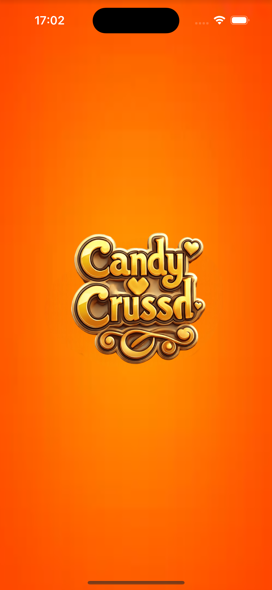
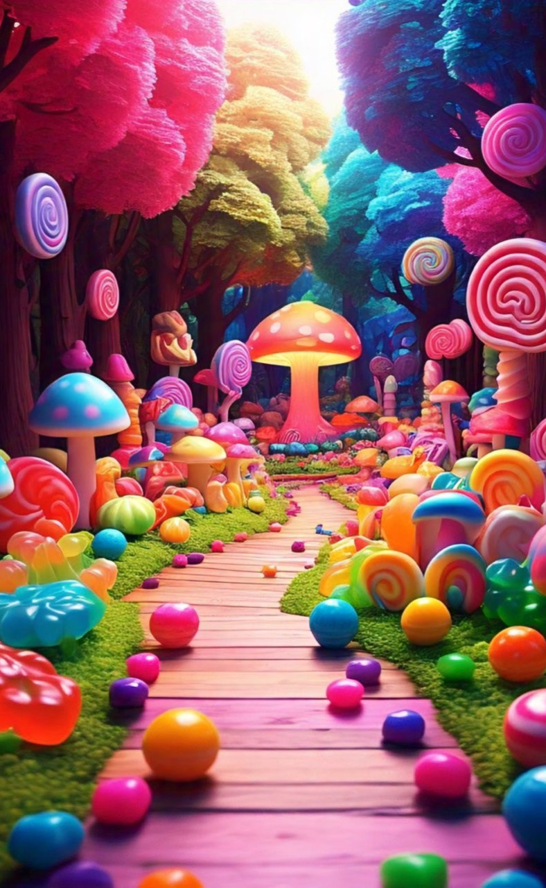
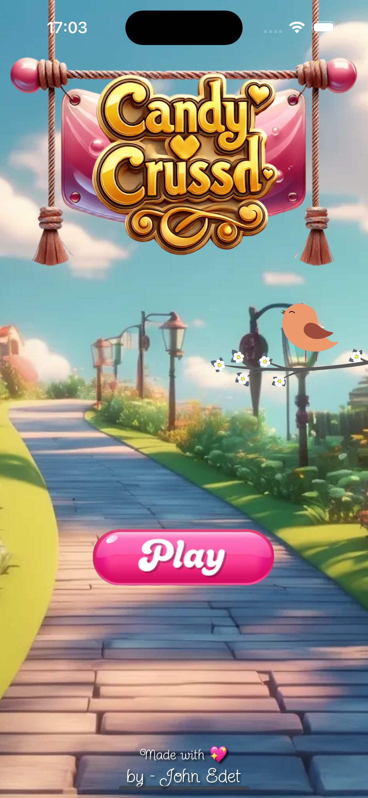
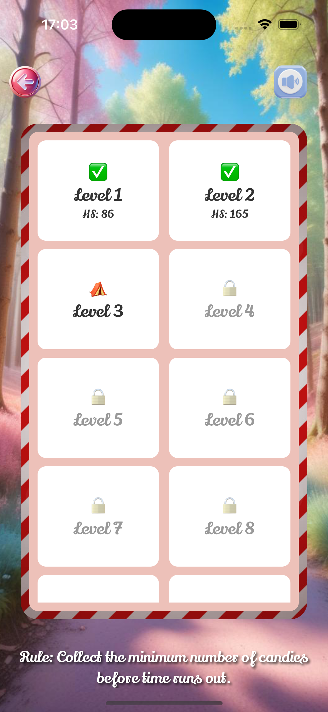
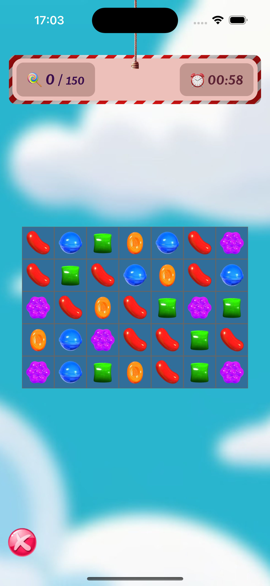

# 🍬 Candy Crush Clone - React Native

A fun and addictive Candy Crush-style game built with **React Native**! Swipe, match candies, beat levels, and challenge yourself with increasing difficulty and high scores.

<p align="center">
  
  
</p>

---

## 🚀 Features

- 🎮 Classic candy match-3 mechanics  
- 🎯 Level-based gameplay with unlockable levels  
- 🧠 Score tracking and high scores per level  
- 🔊 Sound effects and background music toggle  
- 🌟 Responsive animations and effects  
- 📦 State persistence using Zustand and MMKV  
- 🛠 Built with **React Native**, **Zustand**, and **MMKV Storage**

---

## 🧪 Tech Stack

- [React Native](https://reactnative.dev/)
- [Zustand](https://github.com/pmndrs/zustand) – Lightweight global state manager
- [MMKV](https://github.com/mrousavy/react-native-mmkv) – Fast local storage
- Custom sound and animation utilities

---

## 📸 Screenshots

> Place your screenshots inside `assets/screenshots/`
<p align="center">
  
  
  
</p>

## 🧑‍💻 Getting Started
```bash
git clone https://github.com/yourusername/candy-crush-react-native.git
cd candy-crush-react-native
npm install
npx react-native run-android # or run-ios
```

## 📱 Try It Out
Coming soon on Expo or Play Store! 😉

## 🤝 Contributing
Feel free to fork the project, open issues, or contribute features/fixes.

## 📜 License
MIT License © 2025 [https://github.com/iamjhay]

